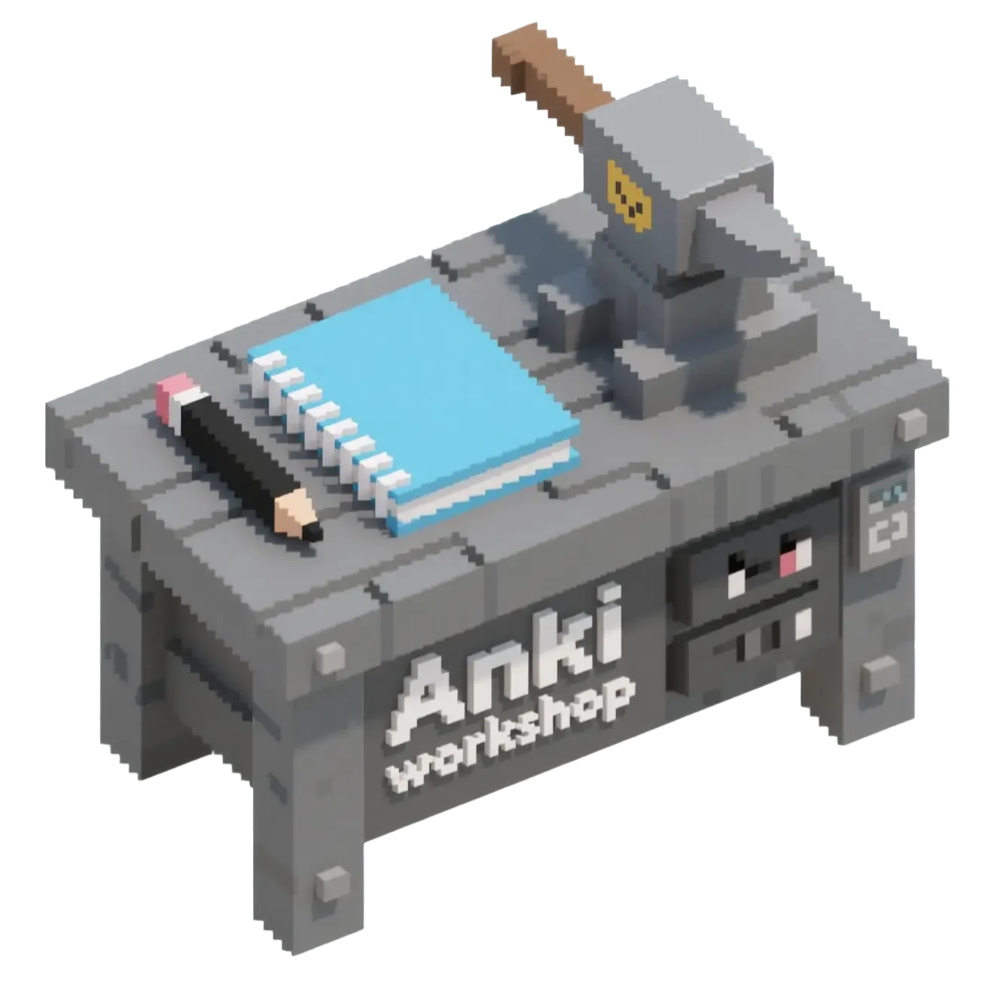

<p style="text-align: left">
    
</p>

# Anki Workshop: Your Universe of Knowledge Awaits

Welcome to Anki Workshop, the ultimate hub for Anki enthusiasts! Dive into a vibrant marketplace where you can upload, preview, and share your amazing Anki templates and decks with learners across the globe. Whether you're a seasoned Anki pro or just starting your flashcard journey, we've got something for everyone. Get ready to supercharge your learning!

## ✨ Features That Spark Joy

* **Seamless Authentication**: Securely log in, register, or reset your account to manage your Anki universe.
* **Deck Management Magic**:
  * **Upload**: Share your brilliant decks and templates with the community.
  * **Preview**: Get a sneak peek of decks before you download them.
  * **Share**: Spread the knowledge far and wide!
  * **Edit**: Keep your creations polished and up-to-date.
  * **New Decks**: Craft fresh, engaging content right here.
* **Robust API Endpoints**: Powering smooth interactions for decks and user images.
* **Personal Dashboard**: Your command center for all your uploaded and favorited content.

## 🛠️ Under the Hood: Technologies That Make It Tick

Anki Workshop is built with a stack of modern, powerful technologies to ensure a smooth and scalable experience:

* **SvelteKit**: Our choice for a lightning-fast, delightful web development experience.
* **Bun**: The ridiculously fast JavaScript runtime and package manager that keeps everything zipping along.
* **Drizzle ORM**: A type-safe ORM that makes database interactions a breeze.
* **Cloudflare Workers & D1**: For serverless superpowers and a robust, distributed database.
* **Tailwind CSS**: For crafting beautiful, responsive, and highly customizable designs with speed.

## 🚀 Getting Started: Ignite Your Development Journey

Ready to contribute or just explore the codebase? Follow these simple steps to get Anki Workshop up and running on your local machine!

### Prerequisites

Before you begin, make sure you have:

* **Bun**: The all-in-one JavaScript runtime. If you don't have it, install it from [bun.sh](https://bun.sh/).

### Installation

1. **Clone the repository**:

    ```bash
    git clone https://github.com/your-repo/anki-workshop.git
    cd anki-workshop
    ```

2. **Install dependencies**:

    ```bash
    bun install
    ```

### Environment Setup

Create a `.env` file in the root of your project based on `wrangler.example.toml` and `sample-env`. You'll need to configure your database and authentication secrets here.

```env
# Example .env content (adjust as per your actual needs)
DATABASE_URL="d1://..."
AUTH_SECRET="your_super_secret_key"
```

## 🧑‍💻 Developing: Let's Build Something Awesome

Once you've set up your environment, starting the development server is a piece of cake:

```bash
bun run dev
```

This will launch the application in development mode, usually accessible at `http://localhost:5173`. Happy coding!

## 📦 Building & Deploying: Share Your Masterpiece

To create a production-ready version of your app:

```bash
bun run build
```

For deployment, Anki Workshop leverages SvelteKit's adapter system. You may need to install an [adapter](https://svelte.dev/docs/kit/adapters) specific to your target environment (e.g., Cloudflare Pages, Vercel, Netlify).

## 🤝 Contributing: Join the Anki Adventure

We love contributions! Whether it's a bug fix, a new feature, or an improvement to the documentation, your help makes Anki Workshop better for everyone.

Let's build the future of Anki together! 🎉
